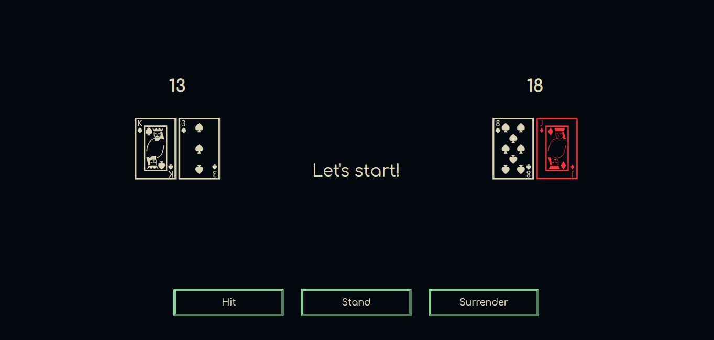

# Title: OOP: Blackjack Game
### PHP Exercise 28/10/2021 - 29/10/2021
 

## Description
First dive into OOP (Object Oriented Programming).
 
 

## The Mission
Let's make a game in PHP: Blackjack! A game of chance and luck!

 

  

## Blackjack Rules
- Cards are between 1-11 points.
    - Faces are worth 10
    - Ace is always worth 11
- Getting more than 21 points, means that you lose.
- To win, you need to have more points than the dealer, but not more than 21.
- The dealer is obligated to keep taking cards until they have at least 15 points.
- We are not playing with blackjack rules on the first turn (having 21 on first turn) - we leave this up to you as a nice to have.

## Flow
  - A new deck is shuffled.
  - Player and dealer get 2 random cards.
  - Dealer shows first card he drew to player.
  - Player either keeps getting hit (asks for more cards), or stands down.
  - If the player at any point goes above 21, he automatically loses.
  - Once the player is done the dealer keeps taking cards until he has at least 15 points. If he hits above 21 he automatically loses.
  - At the end display the winner.

 

## To Do

- [x] Create Player Class.
- [x] Create Blackjack Class.
- [x] Create Dealer Class.
    - [x] Fix "hit" method in order to allow more cards.
- [x] Add the logic in empty Player methods.
- [x] index.php 
    - [x] Require all the files with the classes.
    - [x] Start the PHP session.
    - [x] Use buttons or links to send to the index.php page what the player's action is (i.e. hit/stand/surrender).
        - [x] Fix stand button.
- [x] Fix style for buttons.
- [x] Create messages components (wins or loses).
    <i>Note: Instead create components, displayed value of variable (string).</i>
- [ ] Decrease the number of commits!
- [ ] Implement a betting system.
- [x] Implement the blackjack first turn rule.
